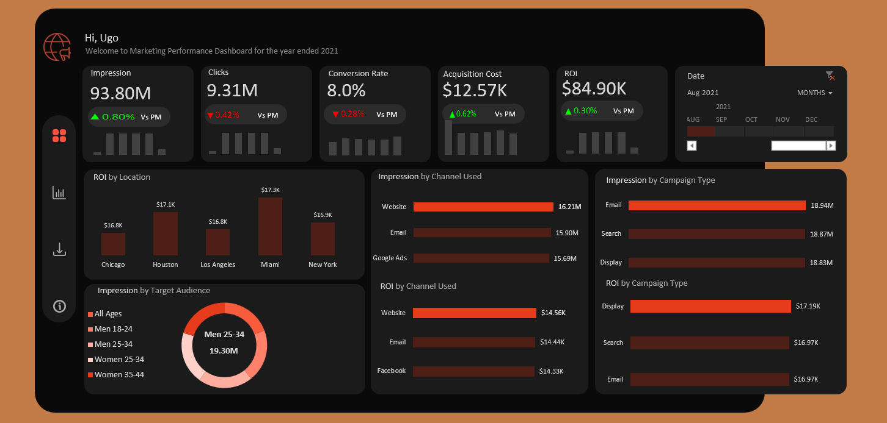

# 📊 Marketing Campaign Performance Analysis

An interactive Excel dashboard designed to analyze marketing campaign performance across locations, channels, campaign types, and target audiences.

## 📌 Project Overview

This project analyzes marketing campaign data to provide a clear view of campaign performance and help identify the channels, locations, campaign types, and audience segments contributing most to marketing results.

The solution was built entirely in **Microsoft Excel**, using **Power Query** for data preparation, **Power Pivot** for data modeling, and **DAX** for KPI and time-intelligence calculations.

The final dashboard allows users to dynamically explore performance over time using an interactive timeline while monitoring key marketing metrics and month-over-month changes.

---

## 🎯 Business Questions

The analysis was designed to answer the following business questions:

- Which locations generate the highest return on investment (ROI)?
- Which marketing channels perform best in terms of impressions and ROI?
- Which campaign types generate the strongest marketing performance?
- Which target audience segments generate the highest impressions?
- How are key marketing KPIs changing month over month?
- Are marketing results improving or declining over time?

---

## 📂 Dataset

The marketing dataset contains approximately **200,000 records** covering campaign activity during **2021**.

Key fields used in the analysis include:

- Campaign Type
- Target Audience
- Channel Used
- Conversion Rate
- Acquisition Cost
- ROI
- Location
- Clicks
- Impressions
- Customer Segment
- Date

---

## 🔄 Data Preparation & Transformation

The dataset was imported and transformed using **Power Query**.

A dedicated date table was created to support time-based analysis. Additional date attributes were derived, including:

- Month Number
- Month Name
- Week of Month
- Quarter

Duplicate and empty date values were removed before the data was loaded into the Excel Data Model.

This provided a structured foundation for monthly and weekly campaign analysis.

---

## 🔗 Data Model

The project uses **Power Pivot** to create a relationship between the marketing campaign data and the Date table.

The Date table acts as the time dimension, allowing campaign performance to be analyzed dynamically across different periods.

This model supports the DAX time-intelligence calculations used throughout the dashboard.

---

## 🧮 DAX Measures

Several DAX measures were created to calculate the primary marketing KPIs.

### Core KPIs

- Total Impressions
- Total Clicks
- Average Conversion Rate
- Average Acquisition Cost
- Total ROI

### Time Intelligence

Additional measures were created to compare current performance against the previous month.

These include:

- Previous Month Impressions
- Previous Month Clicks
- Previous Month Conversion Rate
- Previous Month Acquisition Cost
- Previous Month ROI
- Month-over-Month KPI changes

The calculations allow users to quickly identify whether marketing performance is improving or declining over time.

---

## 📊 Dashboard Features

The interactive dashboard includes:

### KPI Cards
Dynamic KPI cards displaying:

- Impressions
- Clicks
- Conversion Rate
- Acquisition Cost
- ROI

Each KPI includes a month-over-month performance indicator and a weekly trend visualization.

### ROI by Location
Compares return on investment across different campaign locations.

### Channel Performance
Analyzes marketing channels based on:

- Impressions
- ROI

### Campaign Type Performance
Compares campaign types based on:

- Impressions
- ROI

### Target Audience Analysis
Shows the distribution of impressions across different target audience segments and highlights the leading audience.

### Interactive Timeline
Allows users to select different periods and dynamically update the entire dashboard.

---

## 💡 Analytical Capabilities

The dashboard enables marketing teams to:

- Compare marketing performance across locations.
- Identify high-performing marketing channels.
- Evaluate campaign types based on ROI and reach.
- Understand which audience segments receive the greatest exposure.
- Track changes in marketing KPIs over time.
- Detect increases or decreases in performance compared with the previous month.

---

## 🛠️ Tools & Technologies

| Tool | Purpose |
|---|---|
| Microsoft Excel | Dashboard development and analysis |
| Power Query | Data import, cleaning and transformation |
| Power Pivot | Data modeling and relationships |
| DAX | KPI calculations and time intelligence |
| PivotTables | Aggregation and analytical summaries |
| PivotCharts | Interactive data visualization |

---

## 🧠 Skills Demonstrated

This project demonstrates practical experience with:

- Data Cleaning & Transformation
- Data Modeling
- Power Query
- Power Pivot
- DAX
- Time Intelligence
- KPI Development
- Month-over-Month Analysis
- Data Visualization
- Interactive Dashboard Design
- Marketing Performance Analysis
- Business Intelligence
- Translating Business Questions into Analytical Outputs

---

## 📥 How to Use the Dashboard

1. Download `Marketing_Campaign_Analysis.xlsx`.
2. Open the workbook using Microsoft Excel.
3. Navigate to the visuals worksheet.
4. Use the interactive timeline to select a month or reporting period.
5. Review the KPI cards and visualizations to analyze campaign performance.

> **Note:** For the best experience, open the workbook in the desktop version of Microsoft Excel because the project uses Power Pivot, DAX, PivotCharts, and interactive Excel features.

---

## 👤 Author

**Ugo Ikem**

Data Analyst | SQL | Excel | Power BI | Tableau | Python

